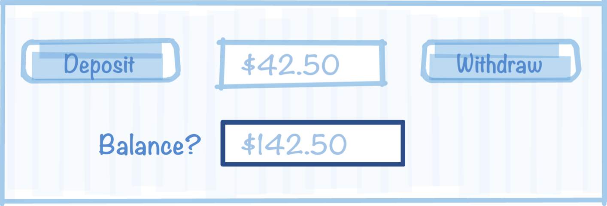

# Eiffel Testing Framework (ETF)

In most applications, there is the **User Interface** (UI) and then there is the **Business Logic**. To take the stock example of a bank ATM, a user might see the following UI:

At the UI, a user can do actions (or commands) such as deposit money, withdraw  money, transfer money, and view the balance. 

The business logic is the part of the computer program that contains the rules that defines or constrains how a business operates. For example, when depositing money to an account, its balance should increase by the deposit, and when withdrawing the balance should not become negative. The data structures and algorithms involved in the business logic perform the behind-the-scenes data processing -- that is invisible to the user -- but is critical to keeping the business running smoothly . 

## Decoupling the Model from User Interface
Such applications often use a pattern called Model-View-Controller (MVC) which is a software design pattern commonly used for developing user interfaces which divides the related program logic into three **loosely connected** elements. 

* The **Model** is the central component of the pattern that may be used to encode the business logic. It has the application's data structures and algorithms, **independent of the user interface**. It directly manages the data, logic and rules of the application.
* The **View** represents the information in the model to the user via forms, charts, tables, etc. and allows the user to invoke new commands by pressing buttons, swiping, tapping, dragging and other gestures or user commands.
* The **Controller** accepts input at the UI and converts it to commands for the model or view.

## Design in EECS-3311
We use ETF in EECS-3311 to **decouple** the User Interface from the Model. The Model is **independent** of the User interface, and can be exported to a web-app, desktop app, mobile app without change.  In each of these cases it is the User Interface that must change, with the model remaining invariant. Thus, in EECS-3311:

1. given the requirements for an application (e.g. a simple bank);
2. the instructor constrains the way in which the application can be used at the User Interface via an abstract UI-grammar;
3. but, there is no constraint on the **design** of the classes in the **Model**. It is here where the design is **open-ended** and it is up to students to design the various classes, their features, the **architecture** (how the classes relate to each other), and the **specification** of the class APIs (via contracts). 
4. Finally, instructors can test the feasibility and correctness of the student's design via acceptance tests that check the application at the User Interface. 

## The abstract UI grammar of a simple bank

