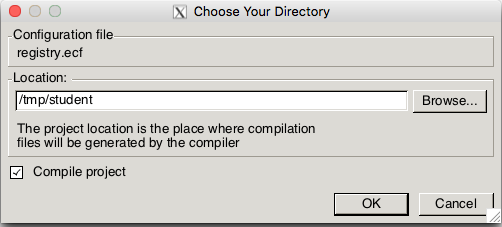
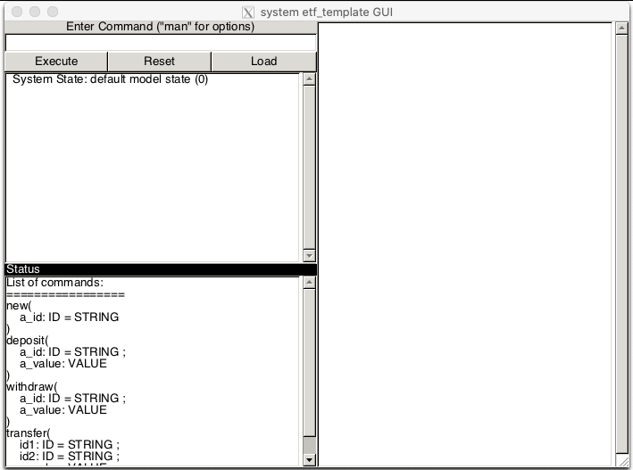
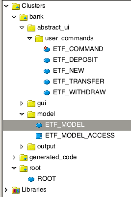
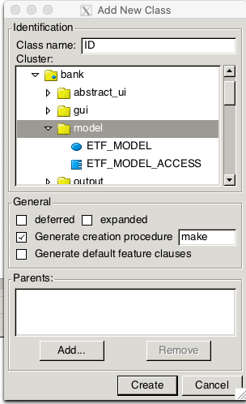

# Eiffel Testing Framework (ETF)

ETF was developed by the Software Engineering Laboratory at York University -- to introduce students to open-ended design problems, while allowing instructors to check the feasibility and correctness of the designs via acceptance testing. See [2018 IEEE 8th International Model-Driven Requirements Engineering Workshop (MoDRE)](https://ieeexplore.ieee.org/document/8501488).

In most applications, there is the **User Interface** (UI) and then there is the **Business Logic**. To take the stock example of a bank ATM, a user might see the following UI:


At the UI, a user can do actions (or commands) such as deposit money, withdraw  money, transfer money, and view the balance. 

The business logic is the part of the computer program that contains the rules that defines or constrains how a business operates. For example, when depositing money to an account, its balance should increase by the deposit, and when withdrawing the balance should not become negative. The data structures and algorithms involved in the business logic -- perform the behind-the-scenes data processing that is invisible to the user -- but is critical to keeping the business running smoothly . 

## Decoupling the Model from the User Interface
Such applications often use a pattern called Model-View-Controller (MVC) which is a software design pattern commonly used for developing user interfaces which divides the related program logic into three **loosely connected** elements. 

* The **Model** is the central component of the pattern that may be used to encode the business logic. It has the application's data structures and algorithms, **independent of the user interface**. It directly manages the data, logic and rules of the application.
* The **View** represents the information in the model to the user at the UI via forms, charts, tables, etc. and allows the user to invoke new commands by pressing buttons, swiping, tapping, dragging and other gestures or user commands.
* The **Controller** accepts input at the UI and converts it to commands for the model or view. In ETF, the Controller is more or less hidden from the designer. 

## Design via ETF in EECS-3311
We use ETF in EECS-3311 to **decouple** the User Interface from the Model. The Model is **independent** of the User interface, and can be exported to a web-app, desktop app, mobile app without change.  In each of these cases it is the User Interface that must change, with the model remaining invariant. Thus, in EECS-3311:

1. students are given the informal requirements for an application (e.g. in this tutorial, a simple bank);
2. the instructor constrains the way in which the application can be used at the User Interface via an abstract UI-grammar;
3. but, there is no constraint on the **design** of the classes in the **Model**. It is here where the design is **open-ended** and it is up to students to design the various classes, their features, the **architecture** (how the classes relate to each other), and the **specification** of the class APIs (via contracts). 
4. There are many possible solutions to the design problem, some being better than the others. Students make design decisions justifying one potential design over others. 
5. Finally, instructors can test the feasibility and correctness of the student's design via acceptance tests that check the application at the User Interface. 

## The abstract UI grammar of a simple bank
It is often premature to start coding a concrete User Interface. Instead we provide an abstract grammar of the actions (or commands) that users can invoke, e.g.


```
system bank
-- simple bank

type ID = STRING
new(a_id: ID) -- add a new account id to bank

deposit(a_id: ID; a_value: VALUE)
withdraw(a_id:ID; a_value: VALUE)
transfer(id1: ID; id2: ID; a_value: VALUE)
```

On any EECS Linux workstation or server (or SEL-VM), at the command line, generate Eiffel code as follows:

```
% ls
ui-grammar.txt
% mkdir bank
% etf -new ui-grammar.txt bank
File created    : bank/bank.ecf
File created    : bank/generated_code/root/etf_cmd_line_root_interface.e
File created    : bank/generated_code/root/etf_root_interface.e
File created    : bank/root/root.e
File created    : bank/bank/model/etf_model.e
File created    : bank/bank/model/etf_model_access.e
...
%
```

At the command line, (1) make a directory `bank`; (2) run the `etf` command on the UI grammar file `ui-grammar.txt bank`; (3) the generated code is placed in directory `bank`.

You can copy the generated code in directory `bank` to your Laptop and continue with the the design of the application on your Laptop, as shown below. 

Use the EiffelStudio/IDE to compile the generated code. First, create a temporary directory in which to compile the EIFGENs (this step not needed on your Laptop). Assuming your login is `student`:

`mkdir /tmp/student`

Now compile your project:

`estudio bank/bank.ecf&`

The above command will compile the project. There is a fairly long initial compile cycle at this point, so be patient. To speed up the compile cycle use the `/tmp/student` directory as follows:



After compilation, if you execute the system, you get the Graphical User Interface:


### Switch to the command line

We **strongly advise** that you immediately switch to the command line interface, from which we will be able to run acceptance tests in batch mode. To do this, change a switch in the ROOT class:

```eiffel
class ROOT inherit ... create
	make

feature -- Queries
	switch: INTEGER
			-- Running mode of ETF application
		do
--			Result := etf_gui_show_history  -- comment this GUI line
			Result := etf_cl_show_history   -- uncomment command line
--			Result := unit_test 		    -- Unit Testing mode
		end

...
end
```

Now recompile, and then create a symbolic link to the workbench executable

`ln -s /tmp/student/EIFGENs/bank/W_code/bank bank.exe`

### Interactive Mode

You can now execute the generated code in **Interactive Mode** (switch `-i`):

```
% ./bank.exe -i
  System State: default model state (0)
->new("pam")
  System State: default model state (1)
->
```

Of course, nothing of value happens as there is no Model logic. 

### Batch mode: acceptance tests

We will want to run in **Batch mode**, using **acceptance tests**. An example of an acceptance test at the UI is:

```
-- basic acceptance test at1.txt
new("pam")
new("max")
deposit("pam", 125.50)
deposit("max", 50.00)
withdraw("pam", 25.50)
transfer("max", "pam", 30.00)
```
Note that the acceptance test `at1.txt` is not in a programming language such as Eiffel (ESpec) or Java (Junit). It is encoded in ASCII text in a manner that a User might understand. 

The **requirements goal** is to obtain behaviour at the command line UI  as follows (`at1.expected.txt`):

```
  System State: default model state (0)
  accounts: 
->new("pam")
  System State: default model state (1)
  accounts:
    pam -> 0.00
->new("max")
  System State: default model state (2)
  accounts:
    pam -> 0.00
    max -> 0.00
->deposit("pam",125.5)
  System State: default model state (3)
  accounts:
    pam -> 125.50
    max -> 0.00
->deposit("max",50)
  accounts:
    pam -> 125.50
    max -> 50.00
-> transfer("max", "pam", 25.00)
  accounts:
    pam -> 150.50
    max -> 25.00
```

Of course, at this point prior to designing the classes in cluster `model`,  all we get is the **default** behaviour in batch mode (switch `-b`):

```
% ./bank.exe -b at1.txt 
  System State: default model state (0)
->new("pam")
  System State: default model state (1)
->new("max")
  System State: default model state (2)
->deposit("pam",125.5)
  System State: default model state (3)
->deposit("max",50)
  System State: default model state (4)
->withdraw("pam",25.5)
  System State: default model state (5)
->transfer("max","pam",30)
  System State: default model state (6)
```

## Design (UI decoupled from Model)

We must now design the business logic and glue the UI commands to the business logic in the model cluster.  The main clusters are as  shown below.



* We never change anything in the cluster `generated_code`
* We can change class `ETF_MODEL` (with care) and add new classes in cluster `model`
* We may access class `ETF_MODEL` via class `ETF_MODEL_ACCESS` using the singleton design pattern.
* We glue user actions received at the UI (e.g. in an acceptance tests) to the model classes via classes in the cluster `user_commands` (as will be shown). 
* Classes in cluster `user_commands` depend on classes in cluster `model` (but **not** *vice versa*). Thus, the `model` cluster -- with the business logic -- is decoupled from the User Interface and does not depend upon it. This is a major goal of ETF, and it means that the business logic can be ported to a desktop-app, a mobile-app or a web-app unchanged. 


## Get the user commands at the UI working

We can do this, user command by user command. We start with the abstract user command: `new(a_id: ID)`.

### new("pam")

We need a class `ID` in the `model` cluster designed in the usual way. We can add this class via the IDE in the usual way:



We will also need a class `ACCOUNT`, so that the model cluster now looks as follows:

```
model
├── account.e             -- new model class
├── etf_model.e
├── etf_model_access.e
└── id.e                  -- new model class
```

In class `ETF_MODEL`, we can add an attribute `bank: FUN[ID, ACCOUNT]` and a command `new(a_id: STRING)`:

```eiffel
class 
	ETF_MODEL ... 
	
feature -- new
	bank: FUN[ID, ACCOUNT]  -- initialize in make

	has(id: ID): BOOLEAN
			-- does `bank` have customer with `id`
		do
			Result := bank.domain.has (id)
		end

	new(id: ID)
		require
			not has (id)
		local
			account: ACCOUNT
		do
			create account.make (id)
			bank.extend ([id, account])
		end

feature -- queries
	out : STRING
		do
			create Result.make_from_string ("  ")
			Result.append ("System State: default model state ")
			Result.append ("(")
			Result.append (i.out)
			Result.append (")")
			Result.append ("%N  ")
			Result.append (bank.out)    -- add this to print state of the bank
		end
end
		
```

When the system is executed, at the UI it prints `{ETF_MODEL}out` to the command line in response to each user command such as `new("pam")`. We have thus extended the `out` query with `Result.append (bank.out)`. 

However, at this point, we have not yet glued the user commands at the UI to the model, so all we get is:

```
% ./bank.exe -b at1.txt 
  System State: default model state (0)
  {  }
->new("pam")
  System State: default model state (1)
  {  }
```

### Glue the command at the UI to the model

The **default** generated template for `ETF_NEW` in sub-cluster `user_commands` is:

```eiffel
class ETF_NEW inherit ETF_NEW_INTERFACE create
	make
feature -- command 
	new(a_id: STRING)
		require else 
			new_precond(a_id)
    	do
			-- perform some update on the model state
			model.default_update
			etf_cmd_container.on_change.notify ([Current])
    	end

end
```

This is the class where the `new("pam")` command is received. We must thus invoke `{ETF_MODEL}new`, as follows:

```eiffel
class ETF_NEW ... feature

	new(a_id: STRING)
		require else
			new_precond(a_id)
		local
			id: ID
    	do
			-- perform some update on the model state
			model.default_update
			create id.make (a_id)
			if not model.has(id) then  -- check precondition 
				model.new (a_id)
			else
				-- provide a message if not
			end

			-- always include the following
			etf_cmd_container.on_change.notify ([Current])
    	end
```

We now obtain more when running the acceptance test:

```
jso% ./bank.exe -b at1.txt 
  System State: default model state (0)
  {  }
->new("pam")
  System State: default model state (1)
  { pam -> (0.00,pam) }
->new("max")
  System State: default model state (2)
  { pam -> (0.00,pam), max -> (0.00,max) }
->deposit("pam",125.5)
  System State: default model state (3)
  { pam -> (0.00,pam), max -> (0.00,max) }
```

However, UI user commands `deposit`, `withdraw` etc. are still not working. There is obviously much more to do.
  
## Continue the Design ...

Apart from the fact that output still does not match the expected, there is still much more to do, and the design is far from the ideal. 

In design, the skill you wish to develop is the ability to distill a complex problem into its simplest components, and to organize the components into a cohesive and maintainable product.

Over to you!

## Topics

[Adding Sub-Clusters in ETF models](topics/sub-clusters.md)

Still To Do:

* Regression testing
* Executing a 

